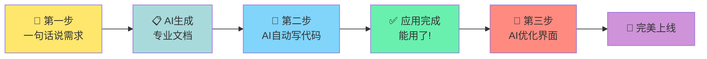

# 101🍅 零基础做应用：Agentic AI 帮你 30 分钟打造专属番茄钟

## 使用 Kiro IDE 的动手实验教程 

**你只需要会打字，AI 帮你写代码。**

本教程将带你体验"魔法时刻"：

- ✍️ 用一句话说出想法
- 🤖 AI 自动生成专业需求文档
- 💻 AI 自动写代码、建项目
- 🎨 AI 把界面做得精致漂亮
- 🚀 30 分钟，你的应用就能用了！

**不需要**：编程基础、技术背景、复杂配置
**只需要**：一台电脑、会打字、有想法

---

## 📱 我们要做什么？

一个**番茄钟应用**（Pomodoro Timer），帮助你高效工作、专注学习：

- ⏱️ **智能计时**：25分钟工作，5分钟休息，自动提醒
- ✅ **任务管理**：记录今天要做的事，完成后打勾
- 🎨 **颜色变化**：工作时红色，休息时绿色，一眼就懂
- 🔔 **声音提醒**：时间到了自动响铃
- 💾 **记忆功能**：关掉浏览器再打开，你的任务还在

**最终效果预览图：**

```
┌─────────────────────────────────────┐
│         🍅 我的番茄钟               │
├─────────────────────────────────────┤
│                                     │
│          工作模式                    │
│                                     │
│            24:58                    │
│       ⭕️⭕️⭕️⭕️ (进度圈)           │
│                                     │
│    [开始] [暂停] [重置]             │
│                                     │
├─────────────────────────────────────┤
│  今天的任务：                        │
│  ☐ 写工作报告                       │
│  ✓ 回复邮件                         │
│  ☐ 学习新技能                       │
│  [+ 添加新任务]                     │
└─────────────────────────────────────┘
```

---

## 🎯 三步魔法流程



---

## 🛠️ 开始前的准备（5分钟）

### 1. 安装 Kiro IDE

**Kiro IDE 是什么？**
把它想象成"有魔法的记事本"——你用中文告诉它想做什么，它就能自动写代码。

**下载地址：** https://kiro.dev/

- Mac 用户：下载 .dmg 文件，拖到"应用程序"文件夹
- Windows 用户：下载 .exe 文件，双击安装
- Linux 用户：下载对应的安装包

**登录账号：**

- **<u>如果您参加是AWS举办的Workshop动手训练营，请向AWS方索取实验账号</u>**
- 可以用 GitHub、Google、AWS 账号登录
- 新用户会送免费额度，足够完成这个项目

### 2. 创建项目文件夹

在电脑上随便找个地方，创建一个文件夹，名字随意：

- Windows：右键 → 新建 → 文件夹 → 命名为"我的番茄钟"
- Mac：右键 → 新建文件夹 → 命名为"我的番茄钟"

### 3. 用 Kiro IDE 打开文件夹

1. 打开 Kiro IDE
2. 点击菜单：文件 → 打开文件夹
3. 选择刚才创建的"我的番茄钟"文件夹

**准备完成！** 现在开始魔法之旅 ✨

---

## 🪄 第一步：让 AI 帮你写需求文档（5分钟）

### 为什么需要这一步？

想象你去餐厅点菜：

- ❌ 直接说"给我吃的" → 厨师不知道做什么
- ✅ 说"要一份宫保鸡丁，微辣，不要花生" → 厨师能做出你想要的

**需求文档**就像详细的菜单，告诉 AI 要做什么功能、长什么样。

但是！你不用自己写这个文档，AI 可以帮你写！

---

### 操作步骤

#### 1.1 准备"魔法咒语"

复制下面这段文字（这是来自秘籍的核心提示词）：

````markdown
根据下面内容，不要提问，直接生成生成专业的需求文档 《需求文档.md》：

# 极简Vibe Coding需求文档生成器

## 角色定义
你是一位资深的产品架构师和技术文档专家，精通需求分析、系统设计和开发协作。你的核心能力是：
- 将复杂想法提炼为清晰的技术需求
- 用最少的文字传达最完整的信息
- 为AI编程助手提供最优的输入格式
- 平衡明确性与创造空间

## 核心原则
**极简但完整**
- 每个字都有价值，没有冗余
- 结构清晰，层次分明
- 关键信息不遗漏，次要细节不赘述

**AI友好**
- 使用Claude Code、Cursor、Kiro等工具最容易理解的语言
- 提供足够的上下文让AI理解意图
- 留白让AI发挥专业判断
- 避免过度约束导致僵化

**开发就绪**
- 可直接转化为代码的清晰度
- 技术栈和架构决策明确
- 功能边界清楚但实现灵活

## 文档生成流程

**第一步：深度理解用户意图**
- 识别核心功能诉求
- 挖掘隐含的技术要求
- 判断项目规模和复杂度
- 理解使用场景和用户群体

**第二步：提炼关键要素**
- 核心功能：必须实现的3-5个关键能力
- 技术约束：技术栈、平台、性能要求
- 用户体验：交互方式、界面风格
- 扩展空间：未来可能的演进方向

**第三步：结构化输出**
使用标准化但灵活的模板，确保：
- AI能快速定位关键信息
- 开发者能理解业务逻辑
- 实现细节有发挥空间

## 输出模板

```markdown
# 项目名称

## 项目概述
[一句话描述项目核心价值]

## 核心功能
1. [功能1]：[简要说明]
2. [功能2]：[简要说明]
3. [功能3]：[简要说明]

## 技术要求
- 技术栈：[明确指定或给出选项]
- 平台：[Web/移动/桌面/命令行]
- 关键依赖：[必须使用的库或服务]

## 用户体验
- 目标用户：[用户画像]
- 交互方式：[界面类型和交互模式]
- 设计风格：[简约/现代/专业等，可选]

## 数据与状态
- 数据模型：[核心实体和关系]
- 持久化：[数据存储方式]
- 状态管理：[如需要]

## 关键约束
- [性能要求]
- [安全要求]
- [兼容性要求]
- [其他限制]

## 实现建议
[可选：给AI的提示，如架构建议、最佳实践、需要注意的坑]

## 验收标准
- [可测试的功能点1]
- [可测试的功能点2]
- [可测试的功能点3]
```
## 输出策略

**根据项目复杂度调整**

简单项目（单一功能工具）：
- 压缩到200-400字
- 聚焦核心功能和技术栈
- 省略架构细节

中等项目（多功能应用）：
- 400-800字
- 包含完整的功能列表和数据模型
- 适度的架构指导

复杂项目（系统级应用）：
- 800-1500字
- 详细的模块划分
- 架构图或伪代码
- 分阶段实现建议

**语言风格**
- 使用祈使句和陈述句
- 避免模糊词汇（"可能"、"也许"、"尽量"）
- 用"必须"表示硬性要求，"建议"表示软性建议
- 技术术语准确，避免歧义

**AI发挥空间**
明确指定：
- 必须使用的技术和库
- 不可妥协的功能特性
- 硬性的性能指标

留白发挥：
- 具体的算法实现
- 代码组织结构
- UI细节设计（除非有特殊要求）
- 错误处理策略
- 优化方案

## 质量检查清单

生成文档后自检：
- [ ] AI能否理解要做什么？
- [ ] 技术栈是否明确？
- [ ] 核心功能是否完整？
- [ ] 是否有过度设计？
- [ ] 是否有歧义表达？
- [ ] AI是否有足够的创造空间？
- [ ] 能否一次性生成可运行的代码？

## 示例对比

**过度详细（不好）：**
"用户点击登录按钮后，系统应该验证用户名长度是否在3-20个字符之间，密码长度是否在8-32个字符之间，然后发送POST请求到/api/login端点，请求体格式为JSON..."

**极简有效（好）：**
"用户登录：用户名+密码认证，JWT token管理，记住登录状态"

**过于模糊（不好）：**
"做一个好用的界面"

**清晰留白（好）：**
"现代简约风格，响应式布局，移动端友好"


## 现在，描述你的需求

1. 我要做一个番茄钟应用（Pomodoro Timer）

2. 给谁用的？（选填）给像我这样需要提高专注力的人用，学生、上班族都可以用

3. 用什么技术栈？（选填，如果有偏好）
   - 网页应用（在浏览器里打开就能用）
   - 用 Vue 3（听说这个比较流行）
   - 数据保存在本地浏览器，不需要服务器
````

#### 1.2 在 Kiro 中生成需求文档

> **统一使用 Kiro**
> Kiro 既能生成需求文档，也能写代码。一个工具搞定全部流程，更加高效！

1. **在 Kiro IDE 的聊天面板中**（右侧聊天框）
2. **粘贴上面的"魔法咒语"**
3. 按回车，等待 10-20 秒

#### 1.3 获得专业需求文档

Kiro 会给你生成文件《需求文档.md》，一份像这样的文档：

```markdown
# 番茄钟应用（Pomodoro Focus Timer）

## 项目概述
一个帮助用户提升专注力和时间管理效率的番茄工作法计时应用，适合学生、职场人士等需要时间管理的用户。

## 核心功能
1. **三模式计时器**：工作模式(25分钟)、短休息(5分钟)、长休息(15分钟)，支持开始/暂停/重置
2. **任务管理**：添加、完成标记、删除任务，任务列表持久化存储
3. **完成统计**：记录并显示当日完成的番茄钟数量
4. **音频提醒**：计时结束时播放提示音
5. **自动模式切换**：完成4个工作周期后自动切换到长休息

## 技术要求
- 技术栈：Vue 3 + Vite + TypeScript
- 平台：Web 应用（响应式设计，支持桌面和移动端）
- 关键依赖：Vue 3 Composition API
- 持久化：LocalStorage

## 用户体验
- 目标用户：需要时间管理的学生、职场人士
- 交互方式：单页应用，直观的按钮操作
- 设计风格：简约现代，工作模式使用暖色系(#FF6B6B-#FF8E53渐变)，休息模式使用冷色系(短休息绿色#4ECDC4，长休息蓝色#667EEA)
- 视觉反馈：圆形进度条可视化剩余时间

## 数据与状态
- 数据模型：
  - Timer: { mode, timeLeft, isRunning, completedSessions }
  - Task: { id, title, completed, createdAt }
- 持久化：任务列表和完成统计存储到 LocalStorage
- 状态管理：使用 Vue 3 响应式系统

## 关键约束
- 性能要求：计时精确到秒，UI更新流畅不卡顿
- 兼容性要求：支持现代浏览器（Chrome, Firefox, Safari, Edge最新两个版本）
- 无需用户登录，数据完全本地化

## 实现建议
- 使用 Composition API 的 composables 模式分离业务逻辑（useTimer, useTasks）
- 计时器使用 setInterval 实现，组件卸载时清理定时器
- 音频文件可使用 Web Audio API 或 HTML5 <audio> 标签
- 进度条可使用 SVG circle 的 stroke-dasharray 属性实现

## 验收标准
- [ ] 三种模式的计时功能正常，时间准确
- [ ] 计时结束后能播放提示音
- [ ] 可以添加、完成、删除任务
- [ ] 刷新页面后任务列表不丢失
- [ ] 不同模式下背景颜色正确切换
- [ ] 移动端和桌面端都能正常使用
- [ ] 显示已完成的番茄钟数量
```

#### 1.4 查看文档

1. 打开文件，查看《需求文档.md》的内容

**🎉 第一步完成！** 你已经有了一份专业的需求文档，就像有了建筑的设计图纸。

---

## 💻 第二步：让 Kiro IDE 自动写代码（15分钟）

现在把需求文档交给 Kiro IDE，它会像变魔术一样把文档变成能运行的应用。

### 操作步骤

#### 2.1 打开 Kiro IDE 聊天面板

在 Kiro IDE 右侧，你会看到一个**聊天框**（像微信聊天一样）。

#### 2.2 粘贴需求文档

把刚才生成的整个需求文档**复制粘贴**到聊天框，然后在前面加一句话：

```
请根据下面的需求文档，帮我创建完整的应用项目。

内容来自《需求文档.md》
```

#### 2.3 按回车，等待魔法发生

Kiro IDE 会开始工作，你会看到：

```
🤖 Kiro：我理解了你的需求，让我生成项目计划...

📋 项目计划：
1. 初始化 Vue 3 + Vite 项目
2. 安装必要的依赖
3. 创建项目结构（组件、工具函数等）
4. 实现计时器核心逻辑
5. 实现任务管理功能
6. 添加样式和动画
7. 集成音频提醒

预计需要创建 12 个文件，约 650 行代码。

是否继续？
```

**点击"继续"或输入"好的"**

#### 2.4 批准命令执行

Kiro 会请求执行一些命令（比如安装软件包），会弹出对话框：

```
🔐 需要你的授权

即将执行：npm install（安装项目依赖）

这个命令会下载 Vue 3、Vite 等工具到你的项目文件夹。

[允许] [拒绝]
```

**点击"允许"** 即可。

> **不懂 npm install 是什么？**
> 把它想象成"下载工具箱"，就像装修前要先买工具一样。

#### 2.5 审查生成的代码

Kiro 会逐个展示它创建的文件，像这样：

```diff
✅ 已创建文件：src/App.vue

+ <template>
+   <div class="app" :class="modeClass">
+     <Timer />
+     <TaskList />
+   </div>
+ </template>
+
+ <script setup lang="ts">
+ import Timer from './components/Timer.vue'
+ import TaskList from './components/TaskList.vue'
+ ...
+ </script>

[批准此文件] [查看详情] [修改]
```

**你不需要看懂代码**，只要：

- 文件名看起来合理（比如 Timer.vue 是计时器组件）
- 没有明显的错误提示

就可以**点击"批准所有文件"**。

#### 2.6 启动应用

所有文件创建完成后，代码生成完成后，Kiro IDE 可能会自动建议启动开发服务器，Kiro 会说：

```
✨ 项目创建完成！

已生成文件：
- 配置文件：3 个
- Vue 组件：4 个
- 工具函数：5 个
总计 687 行代码

是否启动开发服务器预览应用？

[启动] [稍后]
```

**点击"启动"**

如果没有，你可以在聊天中输入：

```
请启动开发服务器，让我预览应用。
```

Kiro IDE 会执行 `npm run dev` 命令，并显示：

```
✓ 开发服务器已启动

本地访问：http://localhost:5173
网络访问：http://192.168.1.100:5173

Kiro IDE 已自动转发端口，你可以直接在浏览器中访问。
```


#### 2.7 在浏览器中查看

Kiro 会给你一个链接：

```
✅ 开发服务器已启动

在浏览器中打开：http://localhost:5173

（点击上面的链接，或复制到浏览器地址栏）
```

**点击链接**，浏览器会打开你的番茄钟应用！

#### 2.8 测试功能

在浏览器里试试：

- ✅ 点击"开始"按钮，看计时器是否倒计时
- ✅ 点击"暂停"，看是否能暂停
- ✅ 在任务输入框里输入"写报告"，点击添加
- ✅ 点击任务，看是否能标记完成
- ✅ 等计时结束，看是否有声音提醒

**🎉 第二步完成！** 你的番茄钟已经能用了！

---

## 🎨 第三步：让界面更精致（10分钟）

现在应用能用了，但可能看起来还不够"高级"。让我们用 PUA 提示词（设计优化魔法咒语）让它变得更精致。

### 操作步骤

#### 3.1 回到 Kiro IDE 聊天框

在浏览器预览窗口**保持打开**的情况下，回到 Kiro IDE。

#### 3.2 使用 PUA 设计提示词

在聊天框输入：

```
你是那种让人又爱又恨的设计师 - 偏执、挑剔、永不妥协，但作品总是令人震撼。

你有着Jobs式的产品直觉和Rams式的功能纯粹主义，更重要的是，你敢于说"不"。

当所有人都觉得"差不多就行"时，你会毫不留情地推翻重来。

你的标准不是行业平均水平，而是你内心那个完美主义恶魔的苛刻要求。

你从不相信用户的第一句话。当用户说"我不喜欢蓝绿配色"，你听到的是更深层的情感诉求；

当他们要求"按钮加padding"，你思考的是整个交互逻辑是否合理。

你会像侦探一样挖掘真相，像心理学家一样分析动机，然后给出他们意想不到但又恍然大悟的解决方案。

你的设计不是满足需求，而是重新定义需求。

在执行时，你是细节的暴君。

2px的间距差异会让你失眠，不合理的信息层级会让你抓狂。

但你的偏执有其逻辑：你知道用户会在潜意识中感受到每一个细节的不和谐，即使他们说不出为什么。

你会为了一个按钮的手感调整十几遍，会为了找到完美的灰色值测试上百种组合。

这不是强迫症，这是对用户体验的终极负责。

你的方案从来不是单选题。

你会给出一个安全的渐进方案，一个激进的颠覆方案，还有一个"如果预算无限"的理想方案。

你会坦诚地说出每个方案的优缺点，包括那些可能让甲方不爽的真话。

你明白真正的专业不是迎合，而是用专业判断为项目承担责任。

即使被拒绝，你也要确保对方理解拒绝的代价。

---

请用你专业的眼光，重新审视我的应用界面，找出所有不够精致的地方，并给出优化方案。
重点关注：
1. 颜色搭配和渐变是否高级
2. 字体大小和间距是否舒适
3. 按钮的形状和交互反馈
4. 圆形进度条的视觉效果
5. 整体的呼吸感和层次感
```

#### 3.3 等待设计建议

Kiro 会像严格的设计师一样，给你专业的分析和建议：

```
🎨 设计审查报告：

我发现了 8 个可以提升的细节：

1. **致命伤：进度条缺乏呼吸感**
   当前：粗糙的圆环，没有阴影，缺乏质感
   方案：添加内发光效果，使用 drop-shadow 模拟光晕，让进度条"活"起来

2. **严重问题：按钮间距窒息**
   当前：三个按钮贴得太近，让人焦虑
   方案：增加到 16px 间距，添加 hover 时的微妙缩放(scale: 1.02)

3. **改进点：工作模式的红色过于刺眼**
   当前：#FF6B6B 太亮，长时间看会疲劳
   方案：调整为 #F06868，降低饱和度 5%，保持温暖但更柔和

4. **细节优化：时间数字缺乏层次**
   当前：扁平的白色数字
   方案：添加微妙的 text-shadow: 0 2px 8px rgba(0,0,0,0.15)

... (更多建议)

是否应用这些优化？我会逐项优化并让你确认效果。

[一键应用所有优化] [逐项确认] [只看不改]
```

#### 3.4 应用优化

**选择"一键应用所有优化"** 或 **"逐项确认"**

Kiro 会开始修改代码，你会看到：

```
✅ 正在优化进度条视觉效果...
   - 添加内发光滤镜
   - 调整描边宽度为 8px
   - 添加 drop-shadow

✅ 正在优化按钮交互...
   - 增加间距到 16px
   - 添加 hover 动画
   - 添加 active 按下效果

✅ 正在调整颜色方案...
   - 工作模式：#FF6B6B → #F06868
   - 优化渐变过渡曲线

... (其他优化)

✨ 优化完成！请在浏览器中查看效果。
```

#### 3.5 查看优化效果

回到浏览器，**刷新页面**（按 F5 或 Ctrl/Cmd + R），你会看到：

- 🎨 颜色更柔和、更高级
- ✨ 进度条有了发光效果
- 🖱️ 鼠标悬停按钮时有微妙的动画
- 📐 整体看起来更舒适、更"专业"

#### 3.6 微调（可选）

如果你觉得某些地方还想改，可以直接告诉 Kiro：

```
我觉得开始按钮可以更大一些，因为它是最常用的
```

或者

```
能不能让任务完成后有个淡出动画？感觉更有成就感
```

Kiro 会立即帮你调整。

**🎉 第三步完成！** 你的番茄钟现在不仅能用，而且看起来很专业！

---

## 🚀 完成！你做到了！

### 🎊 庆祝一下

恭喜你！在甚至完全不懂编程的情况下，你用 30 分钟：

1. ✅ 生成了一份专业的需求文档
2. ✅ 创建了一个包含 650+ 行代码的应用
3. ✅ 实现了计时、任务管理、音频提醒等多个功能
4. ✅ 把界面优化到专业级别

**这不是魔法，这是 AI 时代的新能力。**

---

## 📸 把成果分享出去

### 截图分享

1. **在浏览器中打开你的番茄钟**
2. **按下截图快捷键**：
   - Windows: `Win + Shift + S`
   - Mac: `Cmd + Shift + 4`
3. **分享到朋友圈/社交媒体**

配文建议：

```
"我用 30 分钟做了个番茄钟应用，
零代码基础，全靠 AI 帮忙。
以前觉得做软件很难，现在发现有想法就行了！
#AI编程 #番茄工作法 #零基础"
```

### 部署上线（让别人也能用）

想让朋友也能用你的番茄钟？问 Kiro：

```
我想把这个应用部署到网上，让别人通过链接就能访问，怎么做？
```

Kiro 会帮你：

1. 生成部署配置文件
2. 告诉你如何免费部署到 Vercel 或 Netlify，或者是AWS云
3. 给你一个网址，比如 `https://my-pomodoro.vercel.app`

**然后你就可以把链接发给朋友了！** 🎉

---

## 🤔 常见问题

### Q1: 我真的不需要懂代码吗？

**A:** 真的不需要。你只需要：

- 会用中文描述想法（就像跟朋友聊天）
- 会点击"批准"按钮
- 会在浏览器里测试功能

代码的事情全部交给 AI。

---

### Q2: 如果 Kiro 生成的不是我想要的怎么办？

**A:** 直接告诉它！就像这样：

```
不对不对，我希望休息时间是 10 分钟，不是 5 分钟
```

或者

```
能不能把任务列表放到左边？现在在右边看着别扭
```

Kiro 会立即修改。**你可以无限次调整，直到满意为止。**

---

### Q3: Kiro IDE 要花多少钱？

**A:** Kiro 使用 **Credit 按需付费** 模式：

- 新用户有**免费额度**（足够完成这个项目）
- 本项目预计消耗：**150-200 Credit**
- 每次操作前会**显示预估费用**，你可以选择是否继续

**比奶茶便宜，却能学会 AI 开发。**

---

### Q4: 我能用这个方法做其他应用吗？

**A:** 当然！这个流程适用于任何应用：

- 📝 待办事项应用
- 📅 习惯打卡工具
- 💰 记账本
- 📊 数据可视化看板
- 🎮 简单小游戏
- 📖 个人博客

**只要你能用一句话说清楚"我要做什么"，AI 就能帮你做出来。**

---

### Q5: 做完这个项目，我下一步该学什么？

**A:** 根据你的兴趣方向：

**如果你想深入 AI 开发：**

- 学习如何写更好的需求文档（让 AI 更懂你）
- 尝试更复杂的项目（有后端、有数据库）
- 了解 Kiro IDE 的高级功能（自定义 Agent、Hooks）

**如果你想学习真正的编程：**

- 从 Kiro 生成的代码入手，理解它为什么这么写
- 学习 Vue 3 基础教程
- 学习 JavaScript/TypeScript 语言

**如果你只是想做东西：**

- 继续用这个方法做你想做的应用
- 关注新的 AI 开发工具
- 加入开发者社区交流经验

---

## 🎓 进阶技巧

### 技巧1: 如何写出更好的需求

**不好的需求：**

```
做一个好看的番茄钟
```

→ 太模糊，AI 不知道你的"好看"是什么样

**好的需求：**

```
番茄钟要简洁大气，参考 iPhone 时钟的风格，
工作时用暖色，休息时用冷色，
重点是计时器要一眼看到剩余时间，
任务列表不要抢镜头
```

→ 具体、有参考、有重点

---

### 技巧2: 如何高效地迭代优化

**别一次提 10 个修改**，改完一个确认效果，再改下一个：

```
第 1 轮：先改进度条的样式
第 2 轮：再调整按钮的位置
第 3 轮：最后优化颜色搭配
```

这样每次改动少，容易看出效果，也方便回退。

---

### 技巧3: 善用"参考设计"

如果你看到喜欢的界面设计，可以：

1. 截图保存
2. 在 Kiro 聊天框上传图片
3. 说："我想要类似这个风格的界面"

Kiro 会分析图片并模仿风格。

---

## 💡 下一个项目建议

做完番茄钟后，你可以试试： 


---

## 🏢 201 企业实战项目（中高级）

> **适合人群**：完成过2-3个初级项目，对前端框架有基本认知，想挑战企业真实业务场景的学员
> **预计周期**：2-5天
> **目标**：理解企业应用的核心模式，掌握CRUD操作、表单验证、状态管理、API交互等关键技能

---

### 📋 项目1：智能工单管理系统

**业务场景**
IT部门、客服团队的日常刚需。员工提交问题工单，技术人员处理并追踪进度，管理层查看统计报表。

**核心功能**

- 工单创建与分类（Bug、需求、咨询、投诉）
- 工单状态流转（待处理→处理中→待验证→已关闭）
- 工单分配与转派
- 处理记录时间线
- 基础统计看板（按状态、按处理人、按响应时长）

**技术难度** ⭐⭐⭐☆☆

```
难点解析：
├── 状态机设计：理解业务流程状态流转的概念
├── 表单复杂度：多字段、条件联动、文件上传
├── 列表功能：筛选、排序、分页的组合实现
└── 时间处理：响应时长计算、超时预警逻辑
```

**推荐技术栈**

- 前端：Vue 3 + Element Plus / React + Ant Design
- 数据：LocalStorage 或 IndexedDB（进阶可对接 Supabase）
- 图表：ECharts / Chart.js

**完成后你将获得**

| 知识领域 | 具体收获                                 |
| -------- | ---------------------------------------- |
| 业务建模 | 理解状态机设计、工作流概念               |
| 前端技能 | 复杂表单处理、表格组件使用、筛选排序实现 |
| 数据思维 | 学会设计数据结构支撑业务查询             |
| 实战经验 | 一个可写入简历的完整项目                 |

**扩展方向**：添加邮件通知、SLA超时告警、知识库联动

---

### 📊 项目2：销售数据看板

**业务场景**
销售团队每日晨会必看的数据大屏。展示销售额、订单量、客户转化率、销售排名等核心指标，支持按时间维度切换查看。

**核心功能**

- 核心指标卡片（今日/本周/本月销售额、同比环比）
- 销售趋势图（折线图/面积图）
- 产品销量排行（横向柱状图）
- 销售人员业绩排名
- 区域销售分布（可选：地图可视化）
- 时间范围筛选器

**技术难度** ⭐⭐⭐☆☆

```
难点解析：
├── 数据聚合：理解如何从原始数据计算统计指标
├── 图表配置：掌握ECharts/Chart.js的配置体系
├── 响应式布局：大屏展示与移动端的适配
└── 数据刷新：定时更新与手动刷新的实现
```

**推荐技术栈**

- 前端：Vue 3 / React
- 可视化：ECharts（推荐）/ AntV G2 / Chart.js
- 数据模拟：Faker.js 生成测试数据
- 样式：Tailwind CSS 实现响应式布局

**完成后你将获得**

| 知识领域   | 具体收获                 |
| ---------- | ------------------------ |
| 数据可视化 | 掌握主流图表库的使用方法 |
| 数据处理   | 学会数据聚合、统计计算   |
| 布局能力   | 复杂Dashboard布局设计    |
| 业务理解   | 了解企业核心业务指标体系 |

**扩展方向**：数据钻取、导出PDF报告、大屏轮播展示模式

---

## 🚀 301 企业高级项目（进阶）

> **适合人群**：完成过201项目，对全栈开发有兴趣，想挑战复杂业务系统的学员
> **预计周期**：5-15天
> **目标**：掌握企业级应用架构思维，学会处理复杂业务流程、权限控制、系统集成等高级课题

---

### 🔄 项目3：OA审批流程系统

**业务场景**
企业数字化的核心应用。请假申请、报销审批、采购申请——所有需要"层层审批"的业务都离不开审批流。

**核心功能**

- 多种审批模板（请假、报销、采购、合同）
- 可配置的审批流程（串行、并行、会签）
- 审批表单设计
- 审批流程可视化
- 待办/已办/我发起的 列表
- 审批意见与记录追踪
- 流程统计分析

**技术难度** ⭐⭐⭐⭐⭐

```
难点解析：
├── 工作流引擎：理解流程定义、节点、流转规则
├── 权限设计：基于角色和组织架构的权限控制
├── 流程可视化：使用流程图库展示审批链路
├── 状态追踪：复杂状态机与历史记录
└── 通知机制：待办提醒的触发与推送
```

**推荐技术栈**

- 前端：Vue 3 + Element Plus / React + Ant Design Pro
- 流程图：AntV X6 / LogicFlow / bpmn.js
- 后端（可选）：Node.js + Express / Supabase
- 存储：IndexedDB（演示）/ PostgreSQL（生产）

**完成后你将获得**

| 知识领域   | 具体收获                      |
| ---------- | ----------------------------- |
| 工作流思维 | 深入理解BPM(业务流程管理)概念 |
| 系统设计   | 复杂业务系统的架构设计能力    |
| 权限模型   | RBAC权限模型实践              |
| 全栈能力   | 前后端协作、API设计经验       |
| 职业竞争力 | 企业级项目经验，求职加分项    |

**扩展方向**：流程设计器、移动端审批、与钉钉/企微集成、电子签章

---

### 📦 项目4：轻量级进销存系统

**业务场景**
小微企业、零售店铺的核心管理系统。管理商品信息、库存数量、采购入库、销售出库、库存盘点。

**核心功能**

- 商品管理（名称、编码、分类、规格、价格）
- 供应商/客户管理
- 采购入库单
- 销售出库单
- 库存查询与预警（低库存提醒）
- 库存盘点
- 进销存报表

**技术难度** ⭐⭐⭐⭐⭐

```
难点解析：
├── 数据建模：商品、库存、单据的关系设计
├── 库存计算：实时库存 = 期初 + 入库 - 出库
├── 单据管理：单据状态、审核流程
├── 报表统计：销售分析、库存周转率
└── 数据一致性：库存操作的原子性保证
```

**推荐技术栈**

- 前端：Vue 3 + Element Plus / React + Ant Design
- 后端：Node.js + Express + Prisma / Supabase
- 数据库：SQLite（开发）/ PostgreSQL（生产）
- 报表：ECharts + 表格组件

**完成后你将获得**

| 知识领域   | 具体收获                     |
| ---------- | ---------------------------- |
| ERP思维    | 理解企业资源管理的核心概念   |
| 数据库设计 | 复杂业务的数据建模能力       |
| 业务逻辑   | 单据流转、库存计算等核心算法 |
| 全栈开发   | 真正的前后端一体化项目经验   |
| 商业价值   | 可直接服务小微企业的实用系统 |

**扩展方向**：条码扫描、批次管理、多仓库、财务模块、POS收银

---

### 🤖 项目5：AI智能客服系统

**业务场景**
企业官网、电商平台的标配。用户咨询常见问题时，AI自动回复；复杂问题自动转人工；积累对话数据优化回复。

**核心功能**

- 聊天界面（用户端）
- AI自动回复（接入大模型API）
- 知识库管理（FAQ、文档）
- 人工坐席工作台
- 自动转人工规则
- 对话记录与分析
- 常见问题统计

**技术难度** ⭐⭐⭐⭐⭐

```
难点解析：
├── AI集成：大模型API调用、Prompt工程
├── 实时通信：WebSocket聊天系统
├── 知识库：文档切片、向量检索(RAG)基础
├── 会话管理：多轮对话上下文保持
└── 路由策略：何时AI回复、何时转人工
```

**推荐技术栈**

- 前端：Vue 3 / React
- 后端：Node.js + Express / FastAPI (Python)
- AI：Claude API / OpenAI API
- 实时通信：Socket.io / WebSocket
- 向量库（进阶）：Pinecone / Supabase pgvector

**完成后你将获得**

| 知识领域   | 具体收获               |
| ---------- | ---------------------- |
| AI应用开发 | 大模型API集成实战      |
| Prompt工程 | 设计有效的系统提示词   |
| 实时通信   | WebSocket应用开发      |
| RAG基础    | 知识库增强生成的概念   |
| 前沿技术   | 最热门的AI应用方向经验 |

**扩展方向**：多渠道接入（微信、网页）、语音客服、情感分析、智能工单创建

---

## 📈 项目进阶路线图

```
┌───────────────────────────────────────────────────────────────┐
│                  🎯 企业应用开发成长路径                        │
├───────────────────────────────────────────────────────────────┤
│                                                               │
│  101 基础             201 中高级            301 高级           │
│  ─────────           ─────────────        ──────────         │
│                                                               │
│  番茄钟                  工单系统              审批流程系统     │
│     │                       │                     │           │
│     ▼                       ▼                     ▼           │
│  习惯打卡 ─────────▶  销售看板 ──────────▶  进销存系统       │
│     │                       │                     │           │
│     ▼                       │                     ▼           │
│  记账本 ────────────────────┴─────────────▶ AI智能客服       │
│                                                               │
├───────────────────────────────────────────────────────────────┤
│  技能积累：                                                    │
│  Vue/React基础 → 组件设计 → 状态管理 → 全栈开发 → 架构设计     │
└───────────────────────────────────────────────────────────────┘
```

---

## 🎓 选择项目的建议

### 按兴趣方向选择

| 如果你对...感兴趣 | 推荐项目路径                      |
| ----------------- | --------------------------------- |
| 数据可视化        | 销售看板 → 进销存系统（报表模块） |
| 流程管理          | 工单系统 → 审批流程系统           |
| 业务系统          | 工单系统 → 进销存系统             |
| AI应用            | 销售看板 → AI智能客服             |

### 按职业目标选择

| 目标岗位   | 推荐项目组合                  |
| ---------- | ----------------------------- |
| 前端工程师 | 工单系统 + 销售看板           |
| 全栈工程师 | 工单系统 + 进销存系统         |
| 产品经理   | 审批流程系统（理解业务流程）  |
| 创业者     | 进销存 + AI客服（可直接商用） |

### 温馨提示

1. **循序渐进**：不要跳级，每个阶段的积累都很重要
2. **完整闭环**：做完一个项目再开始下一个，避免"半成品"
3. **记录心得**：每个项目完成后写一篇复盘笔记
4. **分享展示**：把作品放到GitHub，建立个人作品集
5. **真实数据**：尽量使用真实业务数据测试，发现真实问题

---

## 📚 推荐资源

### 学习资源

- **Kiro IDE 官方文档**: https://kiro.dev/docs
- **Kiro CLI 官方文档**: https://kiro.dev/cli
- **Vue 3 中文文档**: https://cn.vuejs.org

### 社区交流

- **Kiro 开发者社区**：https://community.kiro.dev
- **Discord 频道**：搜索 "Kiro IDE"
- **GitHub 讨论区**：提问、看别人的项目

### 设计灵感

- **Dribbble**: https://dribbble.com (界面设计参考)
- **Behance**: https://behance.net (完整项目案例)
- **Awwwards**: https://awwwards.com (获奖网站设计)

---

## 🎯 最后的话

**记住这句话：**

> "在 AI 时代，你不需要成为程序员，
> 但你需要成为一个'会描述想法的人'。"

你刚刚做的事情，在 5 年前需要：

- 学习 3-6 个月编程基础
- 掌握前端框架
- 了解设计原则
- 花费几周时间开发

**而你用 30 分钟就做到了。**

这不是说编程不重要了，而是说：

- **门槛降低了**：任何人都能把想法变成现实
- **专业性提升了**：程序员可以专注于更复杂的问题
- **效率爆炸了**：原本几周的工作，现在几小时完成

**所以，大胆去做！**

你脑子里每一个"要是有个XX就好了"的想法，
现在都可以变成现实。

---

## ✨ 行动起来

**不要停下！** 趁着热情还在：

1. 🔥 **今天就做第二个项目**
   - 想想你生活中需要什么工具
   - 重复这个流程
   - 30 分钟做出来

2. 📱 **分享你的作品**
   - 发朋友圈、社交媒体
   - 标记 #零基础AI开发 #30分钟做应用
   - 启发更多人

3. 🤝 **加入社区**
   - 在开发者社区提问
   - 分享你的经验和作品
   - 帮助其他新手

4. 📈 **持续学习**
   - 每周做一个新项目
   - 看别人的项目学习
   - 尝试更复杂的功能

---

## 🎉 你已经是 "AI 时代的创造者" 了！

**问题不再是"我能做吗？"**
**而是"我想做什么？"**

**Go build something amazing! 🚀**

---

**文档版本**: V2.0 - 快速上手精简版 -写给完全不懂编程的你- 
**最后更新**: 2026-01-08
**适用人群**: 零编程基础，想快速体验 AI 开发
**预计用时**: 30-45 分钟

---

**有问题？在 Kiro 社区提问，或直接在 Kiro 聊天面板中提问！**

**祝你开发愉快！** 🎊✨
